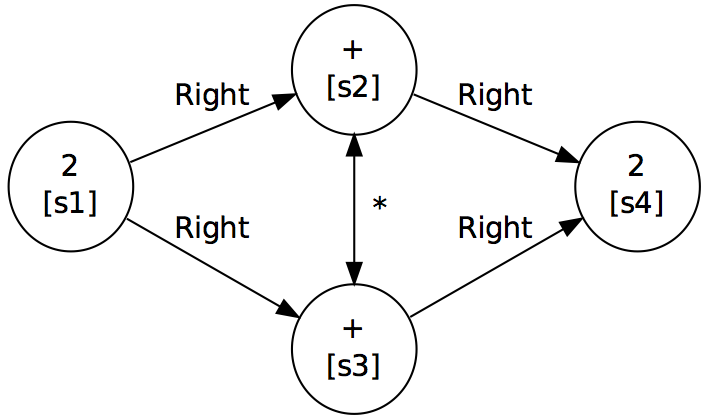
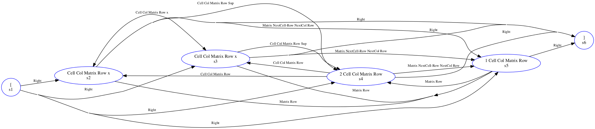

<!-- MathJax Support for in-line LaTeX -->

---

# Label Graph Evaluation Tools (LgEval) 
## Version 0.3.5 (June 2018)  

---  
   
   
*Copyright (c) 2012-2018, Richard Zanibbi and Harold Mouchère*

[Richard Zanibbi][rlaz] (rlaz@cs.rit.edu)  
Document and Pattern Recognition Lab,
Rochester Institute of Technology, USA

[Harold Mouchère][hm] (harold.mouchere@univ-nantes.fr)  
IRCCyN/IVC Lab, University of Nantes, France

[rlaz]: http://www.cs.rit.edu/~rlaz  "Richard Zanibbi's Home Page"
[hm]: http://www.irccyn.ec-nantes.fr/~mouchere "Harold Mouchère's Home Page"
  
---

## License

*These tools are provided 'as is' without any guarantee of suitability for non-research use.  No commercial use is permitted. The tools are being distributed under a Creative Commons license (please see the LICENSE file, and the directory cc_license contains a file detailing the specifics of the license).*

## Contents

* [Notes](#notes)
* [Purpose](#purpose)
* [Installation](#install)
* [Label Graph File Format](#lgdescription)  
	* [I. Primitive Format](#primitive)
	* [II. Object Format](#object)
	* [III. Multiple Levels of Structure](#multiple)
* [LgEval Tools](#tools)
* [Additional Programs](#other)
* [References](#refs)

## Notes

1. For those wishing to use LgEval with the CROHME competition data, you will also need to install CROHMELib, which is provided separately.
	
2. We also ask that you cite the following paper describing label graphs and associated
	metrics in any publications that you produce using LgEval:  
	
	R\. Zanibbi, H. Mouchere, and C. Viard-Gaudin (2013) [Evaluating Structural Pattern Recognition for Handwritten Math via Primitive Label Graphs][drr2013paper]. Proc. Document Recognition and Retrieval, Proc. SPIE vol. 8658, pp. 17-1 - 17-11, San Francisco, CA. 	
3. Information about file differences, metrics and key data structures used for evaluation are provided in the [README_MetricsData.txt][readme2] file. 

 [readme2]: README_MetricsData.txt  "README: Metrics and Data"

## Purpose

The Label Graph Evaluation tools (LgEval) were originally used for scoring handwritten math recognition systems for the [Competition on Recognition of Online Handwritten Mathematical Expressions][crohmeurl] which has been run annually between 2011 and 2014. 
For CROHME, the library was used to obtain stroke and symbol-level evaluation of handwritten math expressions. However, label graphs are a very general formalism, and may be used to represent and evaluate structure for other problems.

A *label graph* is simply a labeled directed graph. Both nodes and edges are labeled, representing the grouping of input primitives into objects (e.g. grouping strokes into symbols), object types (e.g. symbol names) along with relationships between objects. The section [Label Graph Files](#lgdescription) describes the representation in detail. The current version of the library may be used to represent and evaluate multiple levels of structure (e.g. for matrices, which contains symbols, cells, rows, and columns).

Label graphs allow an *absolute* difference between two structural interpretations to be computed, even when the segmentation of primitives into objects disagree, and when primitives are missing in one or other interpretation. This difference is obtained directly from disagreeing edge and node labels, along with associated Hamming distances (i.e. counting disagreeing node and/or edge labels). Input primitives are assumed to be a fixed set, but can represent any object (e.g. connected components, bounding boxes, pixels in an image, or a combination of these).

In addition to metrics, the library provides visualization of label graphs at the primitive and object levels using the **lg2dot** program. Additional information about label graphs and CROHME may be found in the [References](#refs) section. 

[Graphviz]: http://www.Graphviz.org/ "Graphviz web site"

## Installation

**Dependencies:** Before you install LgEval, make sure that the following have also been installed on your system.

1. bash
2. perl (**with LibXML**)
3. python 2.6/2.7
4. Graphviz (for 'dot')
5. TXL (www.txl.ca)  (required for CROHMELib translation tools)

Make sure that *CROHMELibDir* and *LgEvalDir* are defined in
   your shell enviroment, e.g. by including the following in your .bashrc  initialization script for bash shell. The last line adds the
   tools to your search path.
	
	export LgEvalDir=<path_to_LgEval>
	export CROHMELibDir=<path_to_CROHMELib>  	
	export PATH=$PATH:$CROHMELibDir/bin:$LgEvalDir/bin
 
   To avoid warnings about stack sizes from TXL, issue the command below from the bash command line (**Note:** this requires root user priveleges). This increases the maximum call stack size for the shell. You may also be able to add this to your .bashrc or other shell initialization script.

	sudo ulimit -s 16384

---

##  Label Graph File Format

   There are two formats that may be used to represent a label graph, which may be combined in a single file. Additional example .lg files are provided in the *src/Tests/* subdirectory. 
   
### I. Primitive Format (Adjacency Matrix)

This format introduced for CROHME 2013 is the most basic. The .lg file
defines an adjacency matrix for a labeled graph, where
self-edges are node labels. The file defines nodes with identifiers
and labels along with edge labels, with any unspecified labels being
assigned a default value (underscore, '\_'). 

Nodes that belong to the same object are represented by directed edges
labeled '\*' between all pairs of nodes in the object. For example, all
strokes in a symbol are represented by directed '\*' edges between all pairs
of strokes (nodes).

Relationships between objects are represented by edges from all nodes in the
parent object of the relationship to every node in the child object of the
relationship.  For example, a 'Right' relationship may be defined using a
labeled directed edge from every node in the object at left to every stroke
in the symbol at right. Undirected relationships are represented by a pair
of directed edges between nodes (e.g. for the '\*' relationship defining groupings of nodes into objects).

For CROHME, nodes are used to represent strokes, which are grouped into
symbols (objects), with spatial relationships defined between symbols. It is
assumed that every stroke belongs to exactly one symbol. Here is an example of *2+2* provided with LgEval (*src/Tests/2p2\_simple.lg*). There are four strokes (primitives),
named *s1-s4*. The 'right' relationship is represented using the label *Right*, and the
merging of strokes into a symbol by the label *\**.

	# 2 + 2 (Primitive format)
	# Four nodes (strokes, with symbol labels)
	# FORMAT:
	# N, Primitive ID, Label, Weight
	N, s1, 2, 1.0
	N, s2, +, 1.0
	N, s3, +, 1.0
	N, s4, 2, 1.0
	
	# Edges
	# First, undirected merge edge (two directed edges)
	# Strokes s2 and s3 form a '+'
	# FORMAT:
	# E, Primitive ID (Parent), Primitive ID (Child), Label, Weight
	E, s2, s3, *, 1.0
	E, s3, s2, *, 1.0
	
	# Finally, four relationship edges for
	# 2 -Right-> + -Right-> 2
	E, s1, s2, Right, 1.0
	E, s1, s3, Right, 1.0
	E, s2, s4, Right, 1.0
	E, s3, s4, Right, 1.0
                   

An advantage of this representation is that differences between
interpretations can be defined based on disagreeing labels between two
adjacency matrices, with this difference represented in a third adjacency
matrix. This is useful particularly when the groupings of nodes into objects
differs between interpretations.

The graph represented in the .lg file above is shown below. This image was produced using the **lg2dot** tool. Strokes are shown as nodes, and relationships
between strokes as edges.
 

   
 
 
**Fig. 1. Primitive Label Graph for '$2+2$' Written with Four Strokes. Strokes are represented by nodes labeled s1-s4.**
   
###  II. Object Format 
   
   In this representation, an object and its type are defined by a labeled list of primitive identifiers (e.g. the set of strokes in a
   symbol and the symbol type), along with relationships 
   given by labeled edges between objects.

   This is a more compact representation than the 'raw' adjacency matrix
   representation. There is no need to define merge ('\*') edges, and edges are defined between objects rather than primitives. Here is our *2+2* example again, but this time using the object relationship format.

	# 2 + 2 (Object format)
	# 3 objects (symbols)
	# FORMAT:
	# O, Object ID, Label, Weight, List of Primitive IDs (strokes in a symbol)
	O, 2_a, 2, 1.0, s1
	O, +_a, +, 1.0, s2, s3
	O, 2_b, 2, 1.0, s4
	
	# Relationships (2 object edges)
	# FORMAT:
	# R, Object ID (Parent), Object ID (Child), Label, Weight   - OR -
	# EO, Object ID (Parent), Object ID (Child), Label, Weight
	R, 2_a, +_a, Right, 1.0
	R, +_a, 2_b, Right, 1.0

   This format is similar to the one used in the University of Waterloo (Canada)
   [ MathBrush handwritten math corpus ][mathbrush] created by Scott MacLean et al. 
   
   [mathbrush]: https://www.scg.uwaterloo.ca/mathbrush/corpus.shtml  "Mathbrush corpus"

   
###  III. Multiple Levels of Structure

In CROHME 2014, the ability for
nodes to belong to more than one object was added, by allowing a set of
labels to be defined for each node and edge in the underlying adjacency matrix. 
For LgEval to handle this, **object types and relationships must be distinct between
levels of structure, and object labels must be distinct from relationship labels.**
   
For
example, it would be a mistake to use the label 'R' for both the symbol 'R'
and the 'Right-of' spatial relationship. Similarly, using 'Right' to
represent the left-to-right order of symbols on a baseline and the
left-to-right ordering of cells can lead to problems, as it it may confuse
which objects at what level of structure are intended for a given relationship. 
 
**The merging of nodes into objects is also represented differently.** Each node
and edge between nodes in an object have the same label
(e.g.  for CROHME, all nodes and edges for a handwritten *x* are labeled *x*). Provided that labels across structural levels are distinct,
this allows symbols, cells, and rows in a matrix to be distinguished using a
single labeled adjacency matrix.

Below is an example (*/src/Tests/MultiLevelExample.lg*) illustrating the representation
used to accomodate vectors and matrices for CROHME 2014. 
The example is a handwritten vector, a matrix with one row containing x squared and 1. 
Rather than two levels of structure as before for primitives and objects, here there are multiple levels of structure arranged in a hierarchy. From bottom to top of the hierarchy, we have:
   
1. Primitives (six: strokes *s1-s6*)
2. Symbols (five: *[_1, x_1, 2_1, 1_1, and ]\_1*) comprised of Primitives;
3. Cells (two: *Cell_1, Cell_2*) comprised of Symbols;
4. Rows (one: *Row_1*) and Columns (two: *Col_1, Col_2*) comprised of Cells;
5. Matrices (one: *Vec_1*) comprised of Cells;
6. The top-level expression structure comprised of matrices and symbols. 

While it is natural to think of matrices as containing cells, cells containing symbols, etc.,  note that the
**representation of objects is defined using strokes
(i.e. input primitives belonging to each object)**. To limit the size of the file, the containment of symbols in cells, cells in rows, cells in matrices etc. is implicit, as this can be recovered from other information.
At the top level of the expression, cells in a matrix are treated as a unit. It is assumed that there are no empty cells in matrices for CROHME 2014.
   
	# Example of multiple levels of structure: vector [ x^2 1 ]
	# This represents Symbols, Cells, Rows, Columns, Matrix and
	# the top-level expression structure.
	# Symbols (level above primitives (strokes))
	O, [_1, [, 1.0, s1
	O, x_1, x, 1.0, s2, s3
	O, 2_1, 2, 1.0, s4
	O, 1_1, 1, 1.0, s5
	O, ]_1, ], 1.0, s6
	
	# Symbol layout (within cells)
	R, x_1, 2_1, Sup, 1.0
	
	# Cells (level above symbols)
	O, Cell_1, Cell, 1.0, s2, s3, s4
	O, Cell_2, Cell, 1.0, s5
	
	# Rows (1) and Columns (2)
	O, Row_1, Row, 1.0, s2, s3, s4, s5
	O, Col_1, Col, 1.0, s2, s3, s4
	O, Col_2, Col, 1.0, s5
	
	# Vector Grid (contains all strokes in cells)
	O, Vec_1, Matrix, 1.0, s2, s3, s4, s5
	
	# Layout of Cells in our one row, and all cells
	# for both columns.
	R, Cell_1, Cell_2, NextCell-Row, 1.0
	R, Col_1, Col_2, NextCol, 1.0
	
	# Layout of expression at top level (matrices and symbols 
	# outside of matrices)
	R, [_1, Vec_1, Right, 1.0
	R, Vec_1, ]_1, Right, 1.0
	
An illustration of the resulting label graph obtained using **lg2dot** is shown below. Multiple labels for nodes and edges are shown with lists (e.g. "Cell Col Matrix Row Sup" near the top of the graph for an edge from *s2* to *s4*). Where two strokes have a directed edges between them with the same label (i.e. a symmetric relationship), a single edge with two arrows is used (e.g. for "Cell Col Matrix Row x" in both directions between *s2* and *s3*).
	

  

 

**Fig. 2. Primitive Label Graph for '$[x^2 1]$' Written with Six Strokes. Strokes are represented by nodes labeled s1-s6. This graph is complex because of the multiple levels of structure involved. Both edges and nodes may contain multiple labels.**

Fig. 2 is very dense, as it represents the grouping of strokes into different objects, such as the strokes inside the vector being identified as belonging to both symbols and cells of the vector. Fig. 3 presents a filtered version of this graph, representing only the vector contents (as an object labeled *Matrix*), the individual symbols, and the one symbol-level spatial relationship (for $x^2$). As an example of how relationships are represented when there are multiple levels of structure, consider the *Right* relationships between the brackets and the vector contents. There is a *Right* edge from the stroke used to draw the left bracket to each stroke in the Matrix object (as seen in Fig. 1). Similarly, the right bracket is represented as being at *Right* of the Matrix contents by defining an edge from every stroke in the Matrix object to the stroke drawn for the right bracket (again, as seen in Fig. 1).  

  

 

**Fig. 3. Filtered Version of Fig. 2. The graph shows symbols, the *Matrix* object defining vector contents, and the superscript relationship for $x^2$.  **

   
---

## LgEval Tools

The main tools for LgEval are provided in the *bin/* subdirectory. Call a script without arguments for usage instructions. A doxygen-generated summary of files and classes is available at [doc/html/files.html](doc/html/files.html).

**lg2OR and lg2NE**  
    Label graph format converters. Each takes a label graph as input, and outputs a label graph in OR or NE format on standard output.
    
**lg2dot**  
	Create .dot and .pdf output for a label graph, or visualize the
	difference between two label graphs. Different graph types may be
	produced (requires Graphviz), and differences between
	a pair of graphs may also be visualized. The following graph
	types are supported:

  * Primitive label graphs (e.g. as shown in Figs. 1-3 above)
  * Bipartite primitive label graphs
  * Bipartite segmentation graphs for primitives
  * Directed Acylcic Graph (DAG) represention of objects and object relationships 
  * Rooted tree for hierarchical relationship structures (e.g. symbol layout in math expressions)
  
    **Note:** The DAG and tree visualizations assume that a single level of structure is
  being visualized.

**evaluate, evaluateMat**   
	*evaluate* is the main evaluation script for label graphs. It 
	automatically produces metrics, differences, a result summary,
	and visualizations of recognition errors (requires Graphviz). The program
	produces evaluation results given a directory of output files and
	a corresponding directory of ground truth files, or a user-defined file list.
	
*evaluateMat* is used to evaluate output for expressions containing matrices
	(used for the matrix recognition task in CROHME 2014). 

	NOTE: If a node is absent in one of two graphs being compared, it will be inserted as an 'ABSENT' node with unlabeled edges ('_') between the ABSENT node and all other nodes in the graph. See Lg.matchAbsent() in the file lg.py.

**confHist**  
Create structure confusion histograms, which show target structures (e.g. of
1-3 symbols) or stroke groups, along with corresponding error graphs and their
frequencies. To save space, the user can specify the minimum number of times
that an error must occur to be included in the output. This provides a detailed
summary of the specific segmentation and classification errors made by a
recognition algorithm. The structure confusion histograms at the object and
stroke levels are stored in a (large) .html file.

**cdiff, ldiff and vdiff**  
Used to compile labeling errors of given types (*cdiff*), or return the a list of the files containing these errors (*ldiff*) and view them (*vdiff*) using 'less.' Regular expression matching over node and edge labels is supported ('egrep' format), and files with or without segmentation errors may be selected for. These tools operate on the .diff files created by *evaluate.*

**getlg, getinkml, getpdf**  
From a file containing a list of .lg files (one per line), copy these files from one directory to another (*getlg*), or copy corresponding .inkml files or dot-generated pdf files from one directory to another (*getinkml*,*getpdf*).

    
**lg2lgtree**  
	Converts a directory of label graphs using lgfilter (i.e. producing
	trees as output), writing the output files to another directory.
	
**lg2mml**  
	Create MathML output from a label graph (requires CROHMELib). 

**lgfilter**  
	Removes non-tree edges from a hierarchically structured label graph (e.g. to obtain symbol
	layout trees from a DAG with inherited relationships for math notation).  

**relabelEdges and relabelOldCROHME**  
Tools to replace edge labels in 'old' label graph files using '*' to indicate
merged primitives.

## Additional Programs

   All programs below are written in Python (2.x compatible). These
   are located in the *src/* directory.

**metricDist.py**  
	Used to select a metric from a CSV file (.m) produced by the 'evallg.py'
	program (used by **evaluate**). Useful for producing histograms.

**mergeLg.py**  
	Reads two or more .lg files and merges them, printing the result on
	standard output.

**lg2txt.py**   
	Convert a graph to a string encoding. Symbol and structure
	mappings are be defined using rules in an accompanying .csv file. An example MathML mapping file is provided in *translate/mathMLMap.csv.* A (largely incomplete) LaTeX mapping (*translate/symbolMap.csv*) is also provided.
	
**Unit Tests**  
Programs to test functionality for basic label graph operations.  

* testlg.py
* testNewSeg.py

---

## References

Further details about label graphs, the metrics used in LgEval and information about the CROHME competitions may be found in the publications listed below. The file README_MetricsAndDataStructures.txt provides some additional information about metrics produced for the raw results, and data structures used in LgEval.

* H\. Mouchere, R. Zanibbi, U. Garain and C. Viard-Gaudin. (2016) [Advancing the State-of-the-Art for Handwritten Math Recognition: The CROHME Competitions, 2011-2014][ijdar2016]. Int'l Journal on Document Analysis and Recognition 19(2): 173-189.

* H\. Mouchere, C. Viard-Gaudin, R. Zanibbi and U. Garain. (2014) [ICFHR 2014 Competition on Recognition of On-line Handwritten Mathematical Expressions (CROHME 2014)][crohme2014]. Proc. Int'l Conf. Frontiers in Handwriting Recognition, pp. 791-796, Crete, Greece. 

* R\. Zanibbi, H. Mouchere, and C. Viard-Gaudin (2013) [Evaluating Structural Pattern Recognition for Handwritten Math via Primitive Label Graphs Proc. Document Recognition and Retrieval][drr2013paper], Proc. SPIE vol. 8658, pp. 17-1 - 17-11, San Francisco, CA. 

* H\. Mouchere, C. Viard-Gaudin, R. Zanibbi, U. Garain, D.H. Kim and J.H. Kim (2013) [ICDAR 2013 CROHME: Third International Competition on Recognition of Online Handwritten Mathematical Expressions][crohme2013]. Proc. Int'l Conf. Document Analysis and Recognition, pp. 1428-1432, Washington, DC.

* R\. Zanibbi, A. Pillay, H. Mouchere, C. Viard-Gaudin, and D. Blostein. (2011) [Stroke-Based Performance Metrics for Handwritten Mathematical Expressions][icdar2011paper]. Proc. Int'l Conf. Document Analysis and Recognition, pp. 334-338, Beijing. 

[ijdar2016]: http://www.cs.rit.edu/~rlaz/files/CROHME_revision.pdf
[crohme2014]: http://www.cs.rit.edu/~rlaz/files/Crohme2014FinalVersion.pdf "CROHME 2014 ICFHR paper"
[crohme2013]: http://www.cs.rit.edu/~rlaz/files/ICDAR_CROHME2013.pdf "CROHME 2013 ICDAR paper"
[crohmeurl]: http://www.isical.ac.in/~crohme/index.html "CROHME Competition Web Page"
[drr2013paper]: http://www.cs.rit.edu/~rlaz/files/ZMV_DRR2013.pdf "DRR 2013 Paper on Label Graph Metrics"
[icdar2011paper]: http://www.cs.rit.edu/~rlaz/files/MathMetricICDAR2011.pdf "ICDAR 2011 Paper on Stroke-Based Performance Metrics for Handwritten Expressions"

---

*This material is based upon work supported by the National Science Foundation (USA) under Grant No. IIS-1016815. Any opinions, findings and conclusions or recommendations expressed in this material are those of the author(s) and do not necessarily reflect the views of the National Science Foundation.*

